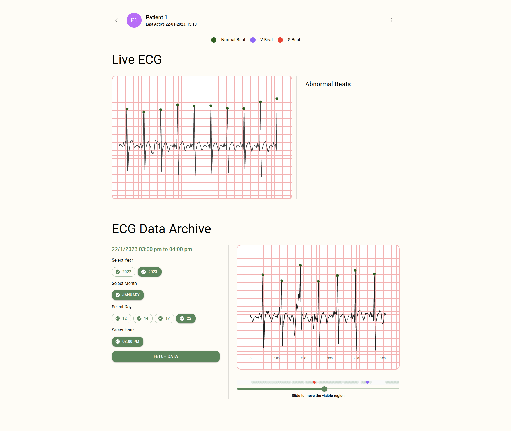

<h1 align="center">Cardiac Zone</h1>

Real-Time ECG Anomaly Detection

    
    
    

 

  

 

## Overview

 

  

 

## [Web Application](https://czone.netlify.app/)

  

  

## License

This work is licensed under [GNU General Public License v3.0](https://github.com/atick-faisal/Cardiac-Zone-Android/blob/main/LICENSE).
